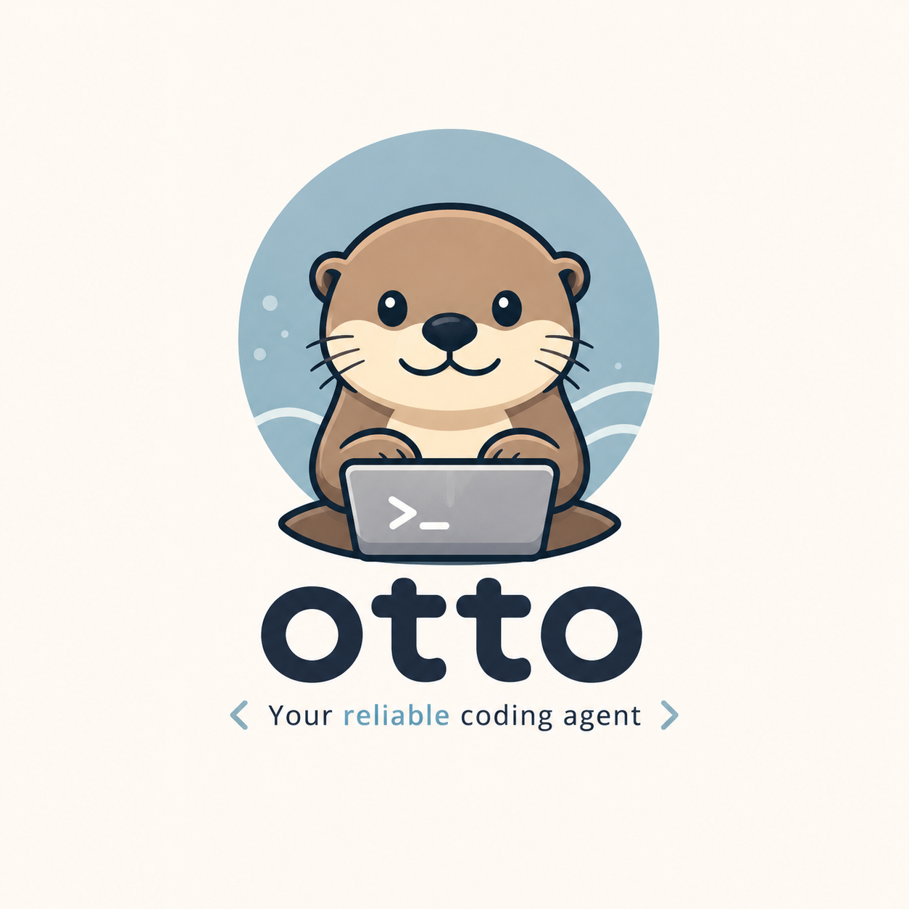

<p align="center">
  
</p>

# Otto

Otto is a minimal macOS coding agent written in Go.

Stage 1 ships adaptive frontends (a full-screen Charmbracelet TUI or a line-oriented REPL), append-only JSONL sessions, manual and automatic context compaction, workspace-bound file tools, a macOS Seatbelt-confined `bash` tool by default, explicit `off` for unsafe direct execution, TOML profiles, and an OpenAI-compatible Chat Completions provider.

For the full usage reference, see the [Otto user manual](docs/user-manual.md).

## Stage 1 status

### Included

- `otto` CLI for macOS
- OpenAI-compatible provider support only
- Adaptive UI selection: full-screen TUI on terminal stdin/stdout, REPL otherwise
- Streaming TUI and REPL with `/help`, `/exit`, `/new`, `/session`, and `/compact`; the TUI also provides `/resume` and `/archive`
- Manual `/compact [focus]` plus automatic proactive and typed-overflow context compaction
- Folded compaction checkpoints and collapsible tool output in the TUI (`Ctrl+O`)
- Built-in `read`, `grep`, `find`, `ls`, `write`, `edit`, and `bash` tools
- Persistent append-only Pi v3 JSONL sessions with `--continue` and `--resume`
- Non-destructive session archiving with `/archive`, `--archive PATH`, and the `archive/` storage directory
- Global TOML configuration at `~/.config/otto/config.toml`
- On-demand skills: reusable instruction sets loaded from `~/.otto/skills` and workspace `.otto/skills` directories
- `--thinking` pass-through for model reasoning effort (`low`, `medium`, `high`, `xhigh`, `max`)
- `--approve` headless mode for non-interactive single-prompt runs

### Excluded in Stage 1

- Codex subscription login
- Claude subscription login
- Anthropic-native provider support
- Plugins or project-local config (workspace-level skills are included; see [Skills](#skills))
- Windows or Linux support commitments
- Session trees/forks, session naming, deletion, or search

Archiving (moving a finished session into `archive/`) is distinct from deletion:
archived files are preserved byte-for-byte, excluded from `/resume`, `--continue`,
and `/archive`, and remain resumable by explicit `--resume PATH`.

### Planned providers

- Stage 2: ChatGPT (Codex) subscription support — **implemented**, see
  [ChatGPT subscription](#chatgpt-subscription-stage-2) below and the design
  spec [`docs/superpowers/specs/2026-09-01-chatgpt-subscription-auth-design.md`](docs/superpowers/specs/2026-09-01-chatgpt-subscription-auth-design.md)
- Stage 3: Claude subscription support

See the approved design: [`docs/superpowers/specs/2026-08-26-otto-coding-agent-design.md`](docs/superpowers/specs/2026-08-26-otto-coding-agent-design.md).

## Prerequisites

- macOS
- Go 1.26+
- One of:
  - a reachable OpenAI-compatible endpoint with SSE chat-completions streaming plus an API key exposed through an environment variable, or
  - a ChatGPT Plus/Pro/Team/Enterprise subscription (see [ChatGPT subscription](#chatgpt-subscription-stage-2))

## Build

```bash
go build -trimpath -o ./otto ./cmd/otto
```

You can then run `./otto ...` from the repo root. If you place the binary on your `PATH`, the same commands work as `otto ...`.

## Quick start

Create `~/.config/otto/config.toml`:

```toml
default_profile = "deepseek"

[ui]
mode = "auto"

[agent]
shell_timeout = "120s"
max_output_bytes = 51200

[agent.compaction]
auto = true
reserve_tokens = 16384
keep_recent_tokens = 20000

[sandbox]
driver = "auto"
network = "allow"
read_paths = []
allow_env = []

[skills]
enabled = true
paths = ["~/.otto/skills", ".otto/skills"]

[server]
socket = "~/.otto/otto.sock"

[profiles.deepseek]
provider = "openai-compatible"
base_url = "https://api.deepseek.com/v1"
model = "deepseek-chat"
api_key_env = "DEEPSEEK_API_KEY"
```

Then export the selected profile's key and start Otto:

```bash
export DEEPSEEK_API_KEY=your-key
./otto --config ~/.config/otto/config.toml --profile deepseek
```

For an ad hoc run without a config file:

```bash
OTTO_API_KEY=your-key ./otto \
  --provider openai-compatible \
  --base-url https://api.deepseek.com/v1 \
  --model deepseek-chat \
  --no-session
```

Set model thinking effort with `--thinking`:

```bash
./otto --thinking high
```

Run a single prompt headless with `--approve` and exit:

```bash
./otto --approve "summarize TODOs in this repo"
./otto --approve @prompt.txt --no-session
./otto --approve "explain main.go" --thinking max --continue
```

Manage sessions without touching the workspace:

```bash
./otto --cwd /path/to/project --continue
./otto --cwd /path/to/project --resume /path/to/session.jsonl
./otto --cwd /path/to/project --archive /path/to/active-session.jsonl
```

## ChatGPT subscription (Stage 2)

Otto can authorize requests with a ChatGPT Plus/Pro/Team/Enterprise subscription instead of a pay-per-token API key, using OpenAI's "Sign in with ChatGPT" OAuth flow (the same mechanism the Codex CLI uses).

Sign in once:

```bash
./otto login
```

`otto login` opens your browser to the OpenAI authorization page and also prints the URL as a fallback. After you approve, credentials are stored at `~/.otto/auth/chatgpt.json` (file mode `0600`). Manage the session with:

```bash
./otto login --status   # show the ChatGPT sign-in state and token expiry
./otto logout           # remove stored credentials
```

Then select the `chatgpt` provider. It needs a `model` but no `base_url` or API key:

```toml
default_profile = "chatgpt"

[profiles.chatgpt]
provider = "chatgpt"
model = "gpt-5-codex"
```

```bash
./otto --profile chatgpt
```

Or ad hoc, without a profile:

```bash
./otto --provider chatgpt --model gpt-5-codex
```

Notes:

- Subscription traffic goes to OpenAI's Responses backend (`https://chatgpt.com/backend-api/codex/responses`), not the Chat Completions endpoint. The wire format differs from the OpenAI-compatible provider, but the CLI, tools, sessions, and compaction behave the same.
- The access token is refreshed automatically from the stored refresh token; rotated tokens are written back to the credential file.
- Tokens are never written to TOML, sessions, or logs, and are stripped from provider error messages.
- This is distinct from exchanging the login for an API key, which bills as API credits rather than subscription quota. Otto does not do that.

## Configuration and precedence

Otto auto-discovers only the global config file at `~/.config/otto/config.toml`. It does not auto-discover project-local configuration, but you can explicitly select any path with `--config`.

Default path:

```text
~/.config/otto/config.toml
```

Review any explicitly selected `--config` file before you run Otto. Otto never auto-discovers repository-local config, but an explicit config path can request `driver = "off"`, additional `read_paths`, or `allow_env` grants on the next process start.

Sandbox defaults and config shape:

```toml
[sandbox]
driver = "auto"
network = "allow"
read_paths = []
allow_env = []
```

On macOS, `driver = "auto"` means `Seatbelt`; Otto never auto-detects or falls back to Docker. If Seatbelt cannot be established, Otto fails closed by disabling `bash` while keeping the six file tools (`read`, `grep`, `find`, `ls`, `write`, `edit`) available.

Startup resolution is field-specific:

- **Profile:** explicit `--profile` selects a profile. Otherwise a startup `--continue` or `--resume` uses the session's stored profile when present; a new session (or an external Pi session without an Otto profile) uses `default_profile`.
- **Provider and model:** explicit `--provider` / `--model` override `OTTO_PROVIDER` / `OTTO_MODEL`. Those environment variables override the selected profile and any provider/model stored in a startup-resumed session. Without direct or environment overrides, startup resume uses the stored provider/model; however, explicit `--profile` makes that profile's provider/model the baseline instead. An explicit profile does **not** outrank `OTTO_PROVIDER` or `OTTO_MODEL`.
- **Endpoint:** `--base-url` overrides the selected profile's `base_url`. There is no base-URL environment override, and session files do not supply an endpoint.
- **API key:** the selected profile determines `api_key_env`. A nonempty value from that environment variable wins; `OTTO_API_KEY` is its fallback. API keys have no CLI flag and must not be stored in TOML.
- **ChatGPT subscription:** the `chatgpt` provider uses OAuth credentials from `otto login` (`~/.otto/auth/chatgpt.json`) and ignores `base_url` and API-key settings; it still requires `model`. See [ChatGPT subscription](#chatgpt-subscription-stage-2).
- **Agent limits:** direct `--shell-timeout` and `--max-output-bytes` values override `[agent]` values, which override built-in defaults. Profiles and resumed sessions do not contain these limits.
- **Sandbox:** `--sandbox auto|seatbelt|off` overrides `[sandbox].driver`; otherwise `[sandbox].driver` overrides the built-in `auto`. `network`, `read_paths`, and `allow_env` come from `[sandbox]` only. Sandbox policy is process-wide and does not change on `/new`, `--continue`, or `/resume`.
- **Skills:** `[skills]` is TOML-only with no CLI flags or environment variables. Skill discovery runs on each runner build (startup, `/new`, `/resume`, `/model`); within a session the catalog is fixed. Existing skill roots are appended to Seatbelt read paths only at process start.
- **Thinking effort:** `--thinking` (`low`, `medium`, `high`, `xhigh`, or `max`) is sent as `reasoning_effort` on OpenAI-compatible requests. It has no environment variable or TOML key and is omitted from requests when unset. Like agent limits, it stays in effect across in-process `/resume` and `/new`.
- **Agent server socket:** `--socket` overrides `[server].socket`, which overrides the built-in default `~/.otto/otto.sock`. There is no environment variable. This setting only applies to `otto serve`; see [Agent server](#agent-server).

Startup `--continue` / `--resume` therefore restores session provider/model only as defaults: direct flags and `OTTO_PROVIDER` / `OTTO_MODEL` can override them as described above. In contrast, an in-process TUI `/resume` restores the selected session's stored provider/model and ignores the process's provider/model/profile/base-URL overrides and `OTTO_PROVIDER` / `OTTO_MODEL`; its stored profile selects the endpoint and key environment. Agent-limit overrides remain in effect. `/new` returns to the runtime resolved at process startup.

`--no-session` cannot be combined with `--continue`, `--resume`, or `--archive`.

UI mode precedence:

1. `--ui`
2. `OTTO_UI`
3. `[ui].mode` in TOML
4. built-in `auto`

Sandbox-driver precedence:

1. `--sandbox`
2. `[sandbox].driver`
3. built-in `auto`

## Context compaction

Compaction is configured in `[agent.compaction]` and, when needed, with per-profile context metadata:

```toml
[agent.compaction]
auto = true
reserve_tokens = 16384
keep_recent_tokens = 20000

[profiles.example]
provider = "openai-compatible"
base_url = "https://example.invalid/v1"
model = "gpt-5.6"
api_key_env = "EXAMPLE_API_KEY"
context_window = 1050000
compaction_window = 272000
```

Rules and defaults:

- `auto=true` is the default.
- `reserve_tokens=16384` and `keep_recent_tokens=20000` are the defaults.
- `context_window` and `compaction_window` must be at least `4096` when set.
- `compaction_window` requires `context_window` and must not exceed it.
- For small configured windows, Otto clamps reserve/keep downward so compaction still fits.

Manual compaction stays available in both frontends even when `auto=false`:

- TUI: type `/compact` or `/compact focus on X`
- REPL: enter `/compact` or `/compact focus on X`

The optional `focus` text is sanitized, bounded to 8 KiB after control cleanup, and appended only to the hidden summary-system prompt.

With `auto=true`, Otto does two bounded automatic checks:

- **Proactive compaction:** when Otto knows the model window and the next request estimate is above the soft trigger (`working_window - reserve_tokens`), it attempts one checkpoint before sending the normal provider request.
- **Reactive overflow recovery:** when the provider returns a typed context-overflow error, Otto can do one automatic compaction and retry once.

The automatic paths are one-shot only. They do not loop. If `auto=false`, Otto skips those automatic attempts but `/compact` still works.

### Model window metadata

Stage 1 still talks only to the `openai-compatible` transport, but Otto ships a static limit catalog for common GPT, o-series, and Claude model IDs so it can size compaction conservatively.

Important boundaries:

- Listed full-size GPT-5.4 / 5.5 / 5.6 aliases use static `context_window=1050000`, `hard_input_window=922000`, and `compaction_window=272000`.
- `gpt-5.4-mini`, `gpt-5.4-nano`, GPT-5 / 5.1 / 5.2 aliases, and `gpt-5.3-codex` use the 400K catalog family with a 272K working window.
- `gpt-5.3-codex-spark` is an exact `128000`-context / `32000`-output override, and `*-chat-latest` aliases use their catalog chat values.
- GPT-4.1, GPT-4o, o1/o3/o4, and listed Claude aliases/snapshots use the static catalog values compiled into this build.
- Claude metadata is used only when your OpenAI-compatible endpoint exposes a Claude-family model ID. Otto does **not** add an Anthropic provider in Stage 1.

The 272K GPT working boundary is intentional. Otto compacts well before the hard ceiling to keep regular turns in a cost-aware range. A checkpoint also changes the prompt prefix, so provider prompt-cache hits can reset once immediately after compaction.

If a model ID is unknown to Otto, proactive safe-limit automation is disabled because no trustworthy local window is available. Reactive one-shot recovery can still happen after a typed provider overflow. For private deployments, set `context_window` and optionally `compaction_window` on the selected profile to restore deterministic proactive behavior.

## Memory

Otto has a local, per-workspace/per-user memory store backed by SQLite/FTS5 (`internal/memory`, `internal/memory/sqlite`). It is enabled by default.

Config (`[memory]` in TOML; all keys optional):

```toml
[memory]
enabled = true          # default true
backend = "sqlite"      # only supported value
required = false        # true: fail startup if the store can't open; false: degrade to disabled with a warning
recall_tokens = 2000
max_results = 12
require_encryption = false

[memory.sqlite]
path = "~/.otto/memory/memory.db"   # default when unset
busy_timeout = "5s"

[memory.workspace_ids]
"/canonical/path/to/workspace" = "stable-id"   # keeps records when a workspace moves
```

There are no `--memory-*` CLI flags.

What's wired:

- **Recall:** before every turn, Otto searches the store (user and workspace scopes) with the user's message and injects matching records as a request-local, untrusted context block. It is never written to the Pi session JSONL, compaction summaries, or logs. A recall failure emits a warning and the turn continues without memory context.
- **Agent-facing tools:** `memory_search`, `remember`, `forget` are registered for the model. Writes from these tools always land as **pending candidates** — the record has no effect until a human reviews it with `/memory review <id> accept|reject` (or its rejection).
- **Human-facing commands** (TUI and REPL): `/memory search <query>`, `/memory forget <id>`, `/memory review <id> accept|reject`, and `/remember [--scope user|workspace] [--kind K] [--key K] <text>`. Unlike the model's tools, `/remember` and `/memory forget` take effect immediately — no review step, since a human typing the command is the review.
- **Standalone CLI:** `otto memory status` prints whether memory is enabled/usable and its store path; `otto memory forget <id>` deletes a record (tries the user scope, then the workspace scope).

Not yet implemented:

- No automatic extraction — nothing calls `Binding.Observe`; only explicit `remember`/`/remember` writes exist today.
- No backup/restore/verify (`Maintenance` is a permanent stub) and no multi-process locking beyond SQLite's own.
- No `otto memory backup|backups|verify|restore` subcommands.

Design reference: [`docs/superpowers/specs/2026-08-29-extensible-memory-design.md`](docs/superpowers/specs/2026-08-29-extensible-memory-design.md).

## Skills

Otto can load reusable instruction sets ("skills") on demand. A skill is a directory containing a `SKILL.md` file with YAML frontmatter and Markdown body, following the Agent Skills format so existing skills can be copied in unchanged. Skills from `~/.otto/skills` (user level) and `<workspace>/.otto/skills` (workspace level) are discovered automatically on startup and `/new` / `/resume` / `/model`. The model sees a compact listing of every available skill in the system prompt and can request the full instructions of a specific skill by name.

Config (`[skills]` in TOML; all keys optional):

```toml
[skills]
enabled = true                              # default true
paths = ["~/.otto/skills", ".otto/skills"]  # default; later entries win on a name conflict
```

- `~/` expands to the user's home directory.
- Relative entries resolve against the workspace.
- `paths = []` leaves no roots; `enabled = false` turns the feature off.
- `enabled = false` skips discovery, the tool, the prompt section, and sandbox read paths.

What's wired:

- **Prompt listing:** when at least one skill is found, a `## Skills` section appears in the system prompt after the `## Environment` section, capped at 8 KiB; skills that do not fit are dropped with a stderr warning.
- **Skill tool:** the `skill` tool is registered only when the catalog is non-empty and returns a skill's instructions by name, plus a listing of supporting files within the skill directory. A second optional `file` parameter reads a single file inside the skill directory.
- **Sandbox integration:** existing skill roots are appended to the macOS Seatbelt read paths at process start, so `bash` can run skill scripts by absolute path. Roots that do not exist are not added; `enabled = false` adds none.
- **Validation and warnings:** `name` must equal the directory name (1 to 64 characters of `a-z`, `0-9`, `-`; no leading, trailing, or doubled hyphen) and `description` must be 1 to 1024 characters. Other frontmatter keys are ignored. An invalid skill or an unreadable root prints one `warning: skill ...` line on stderr and is skipped; startup never fails because of a skill.
- **Cost and persistence:** the listing is re-sent on every request (about 80 tokens per skill). A loaded `SKILL.md` body is a normal tool result: it is written to the session file, survives `/resume`, and is re-sent on every later request until compaction. Tool output is capped at `[agent].max_output_bytes`.
- **Trust:** skill text is user- or repository-provided instruction text of the same class as `AGENTS.md`; it cannot override the system prompt, the user's requests, or the sandbox policy, and it passes through the API-key redactor. Never store secrets in skill files.

Not yet implemented:

- `/skills` and `/skill <name>` user commands — the skill tool is available to the model only today.
- `allowed-tools` enforcement per skill (parsed but ignored).
- Hot reload inside a session: a skill added while Otto runs is discovered on the next `/new`, `/resume`, or `/model`; a root created while Otto runs becomes readable by `bash` on the next start.
- Reading `~/.claude/skills`.

Design reference: [`docs/specs/2026-09-03-skills-design.md`](docs/specs/2026-09-03-skills-design.md).

## Sub-agents

The `agent` tool starts a child agent loop in the same workspace, sandbox, and provider as the parent, on the session model or the `model` given in the call, with a fresh context: the child's session holds only its own system prompt and the delegated prompt, not the parent's conversation. The child runs asynchronously in a goroutine while the parent keeps working.

Parameters: `prompt` (required), `description` (optional, capped at 80 characters, shown in status output), `wait` (optional bool: start the task and block until it ends, returning its result instead of its id), `model` (optional, provider model id; default the session model; not validated by Otto).

Otto keeps no model list or price data; the model chooses which model id to pass, and an id the endpoint rejects fails the task with the provider's error.

Result: `task t3 (default) started`, or `task t3 (default) queued (4 running, limit 4)` once four children are already running.

What's wired:

- **`agent_wait`**: blocks the parent turn until selected tasks finish. Parameters: `task_id` (optional; omitted waits for every queued or running task), `timeout_seconds` (optional, default 600, max 3600). Returns each task's completion text. A canceled turn ends the wait with `wait canceled; still running: ...`; the tasks keep running. A timeout returns `timed out after Ns; still running: ...`.
- **`agent_status`**: without `task_id`, one line per task (id, status, elapsed time, tool count, current activity or final token total, and a label). With `task_id`, that line plus the task's last 10 steps and, once finished, its result or error.
- **Notifications**: a finished task pushes a `[task-notification]` message into the parent's inbox, for example:

  ```
  [task-notification] task t1 (default) succeeded · gpt-4o-mini · 42s · 7 tool calls · 12,310 tokens
  <final report>
  ```

  (A `failed` task shows its error instead of the report; a `canceled` task shows neither; both omit the token count.) The notification is appended to the session as a display context message and persisted as a Pi v3 `custom_message` entry, so `/resume` still shows it. A finished task with no active turn wakes the REPL automatically and runs an empty-text turn to deliver it. In the TUI and `otto serve`, the same notification renders only at the start of the next turn; neither frontend starts a turn on its own yet.
- **Child tool set**: the parent's tools minus `agent`, `agent_wait`, `agent_status`, `remember`, `forget`, and `memory_search` — no memory recall, no nested delegation. `bash` runs under the same sandbox mode as the parent.
- **Concurrency**: at most 4 children run at once per session, a fixed limit; further `agent` calls wait in the `queued` state and can still be canceled.
- **REPL commands**: `/tasks` lists every task in the session; `/task <id>` shows one task's line, its recent steps, and its result or error once finished; `/task cancel <id>` cancels a queued or running task.

  ```
  > /tasks
  t1   (default)  succeeded    42s   7 tools  12,310 tokens            review the diff
  t2   (default)  running      12s   4 tools  grep "session"           find where sessions are written
  ```
- **Cancellation**: Esc/Ctrl-C cancels the parent's turn only; canceling a task needs `/task cancel <id>`.

Not yet implemented:

- Named agent definitions, `[agents]` TOML configuration, and `context: inherit`.
- Parent-to-child messages (`agent_send`, `agent_cancel`, `agent_report`).
- A TUI task panel and automatic wake in the TUI and `otto serve`.
- Server task routes (list/get/cancel).
- Child transcript persistence: transcripts live in memory only and are lost on `/new`, `/resume`, `/model`, and exit, which also cancel any children still running.
- Child token usage in the session's overall usage total: `agent_status`, `/tasks`, and the notification show it, but it is not part of the session usage total and does not survive `/resume`.

Design reference: [`docs/specs/2026-09-03-subagents-design.md`](docs/specs/2026-09-03-subagents-design.md).

## Frontends

Examples:

```bash
otto --ui auto
otto --ui tui
otto --ui repl
OTTO_UI=repl otto
```

Selection rules:

- `auto` starts the full-screen TUI only when **both** stdin and stdout are terminals.
- `auto` falls back to the line-oriented REPL for piped input, redirected output, and other non-TTY runs.
- `tui` forces the full-screen UI and fails fast if stdin or stdout is not a terminal.
- `repl` forces the line-oriented REPL even from an interactive terminal.
- In `auto`, non-TTY runs stay in the REPL and do not emit alternate-screen control sequences.

### Headless mode

`--approve` runs a single prompt without interaction and exits: `0` on success, `1` on error, `130` on interrupt. The value is the prompt text, or `@PATH` to read the prompt from a file (bounded to 1 MiB). Output uses the REPL's line-oriented rendering without the banner or input prompts. Otto's tools never require interactive approval; `--approve` only supplies the prompt and removes the interactive loop. It cannot be combined with `--ui tui`, and it composes with `--continue`, `--resume`, and `--no-session`.

```bash
otto --approve "summarize TODOs in this repo"
otto --approve @prompt.txt --no-session
```

### TUI behavior

- The TUI renders inline into the terminal. Finished transcript entries are printed into the terminal's native scrollback; text selection and scrolling are handled by the terminal.
- Assistant responses render as Markdown in the transcript.
- If Markdown rendering fails, Otto falls back to escaped plain text instead of raw control sequences.
- Tool calls and compaction checkpoints are folded by default; `Ctrl+O` toggles full tool arguments/output and expanded compaction summaries. Toggling affects only entries not yet printed and later entries.
- The bottom of the screen holds a live region for the in-progress turn, slash-command suggestions, editor, and footer; its height follows its content.
- The footer adapts to the available width and shows workspace/profile/model, token totals, and session ID when space allows.
- If the terminal is smaller than `40x8`, Otto shows a resize message until the window is large enough.
- Window resize redraws only the live region; the terminal handles reflow of scrollback lines.

### TUI keys

| Key | Action |
| --- | --- |
| `Enter` | Submit the current prompt or an exact slash command |
| `Tab` | Complete the selected slash-command suggestion |
| `↑` / `↓` | Select a slash-command suggestion |
| `Shift+Enter` / `Alt+Enter` | Insert a newline in the composer |
| `?` | Open the help overlay when the composer is empty |
| `Ctrl+O` | Toggle complete tool arguments, tool output, and folded compaction summaries |
| `Esc` | Cancel the active turn or close the current overlay |
| `Ctrl+C` | Cancel, clear, then quit on a second press within one second |

### Slash commands

In the TUI, typing `/` opens a filtered command suggestion panel. Use `↑`/`↓` to select a command and `Tab` to complete it; `Enter` executes only an exact command.

Shared commands:

- `/help` shows command help (TUI overlay or REPL text).
- `/session` shows session details. In the TUI it opens an overlay with the session ID, path, provider, profile, and model.
- `/new` closes the current session and starts a fresh one in the same process.
- `/compact [focus]` creates a manual context checkpoint or reports `[context] no-op` when nothing can be compacted.
- `/exit` exits when idle. In the REPL, EOF also exits.

TUI-only commands:

- `/resume` opens a modal containing up to the 20 most recently modified valid sessions for the current canonical workspace. Use `↑`/`↓` or `PgUp`/`PgDn` to navigate, `Enter` to resume, and `Esc` to close it. It does not search other workspaces or session contents.
- `/archive` opens the same picker to archive a session. `Enter` on a non-current session moves it into `archive/` and shows `archived session <id>`; `Enter` on the current session archives it and starts a fresh session. `Esc` closes without archiving.

## REPL behavior

- Otto accepts one prompt per line.
- `/help` shows commands.
- `/session` prints the current session ID, path, provider, and model.
- `/new` closes the current session and starts a fresh one in the same process.
- `/archive` archives the current session and starts a fresh one, printing the archived path and the new session ID.
- `/compact [focus]` creates a manual context checkpoint or reports `[context] no-op`.
- `/exit` or EOF exits.
- `Ctrl+C` during an active provider call, tool run, or manual compaction cancels only that turn and returns you to the prompt.
- `Ctrl+C` while Otto is idle exits with status 130.

## Agent server

`otto serve` runs Otto as a long-lived HTTP+JSON+SSE frontend over a Unix domain socket, instead of the TUI or REPL. One process serves one workspace and manages any number of sessions; turns in different sessions run concurrently, and starting a second turn on a session that already has one active returns `409`. Stage 1 listens on a Unix domain socket only; there is no TCP listener.

```bash
otto serve [--socket PATH]
```

`serve` accepts the same startup flags as the interactive frontends (`--config`, `--cwd`, `--profile`, `--provider`, `--base-url`, `--model`, `--thinking`, `--sandbox`, `--shell-timeout`, `--max-output-bytes`) plus `--socket`. It rejects `--ui`, `--approve`, `--resume`, `--continue`, `--archive`, and `--no-session`.

### Socket

The socket path resolves in this order: `--socket` > `[server].socket` (TOML) > the built-in default `~/.otto/otto.sock`. Otto creates a missing parent directory with mode `0700`, creates the socket file with mode `0600`, and refuses to start if a live server already owns that path.

### HTTP API

API endpoints are under `/v1/`; `/healthz` and `/metrics` are served at the root. Request and error bodies are JSON; an error body has the shape `{"error":{"code":"...","message":"..."}}`.

| Method and path | Behavior |
| --- | --- |
| `POST /v1/sessions` | Create a session (`{}`) or attach to one already open in this process (`{"resume":"<id>"}`). `201` for a new session, `200` for an already-open one. Returns the session object. |
| `GET /v1/sessions` | List sessions: on-disk sessions merged with sessions currently open in this process, each flagged `open`. |
| `GET /v1/sessions/{id}` | Return one open session's info. `404` if the session is not open. |
| `DELETE /v1/sessions/{id}` | Cancel any active turn, close the session, `204`. |
| `GET /v1/sessions/{id}/history` | Return the session's message history. |
| `POST /v1/sessions/{id}/turns` | Start a turn: `{"text":"...","stream":true}`. `stream` defaults to `true` and returns a `text/event-stream` response starting at sequence `0`; `stream:false` waits for the turn to finish and returns its summary instead. |
| `GET /v1/sessions/{id}/turns/{turn_id}` | Return a turn summary. Only the session's most recent turn is retained. |
| `GET /v1/sessions/{id}/turns/{turn_id}/events?after=N` | Re-read the most recent turn's event stream from sequence `N+1`; also honors the `Last-Event-ID` header. |
| `POST /v1/sessions/{id}/turns/{turn_id}/cancel` | Cancel the turn, `202`. |
| `GET /v1/info` | Process-level static info: workspace, provider, profile, model, sandbox summary, and the configured profile names. |
| `GET /v1/openapi.yaml` | The OpenAPI 3.1 document for this API. |
| `GET /healthz` | `{"status":"ok","sessions_open":N,"turns_active":N,"uptime_seconds":N}`. |
| `GET /metrics` | Prometheus text-format metrics. |

A turn keeps running after its client disconnects; `POST .../cancel` is the only way to stop it.

### Events

Each SSE frame carries `id: <sequence>`, `event: <name>`, and a JSON `data:` payload. Event names are the `agent.Event` type names: `agent_started`, `text_delta`, `tool_call_started`, `tool_call_finished`, `provider_usage`, `compaction_planned`, `compaction_started`, `compaction_completed`, `compaction_warning`, `memory_warning`, `agent_finished`, and `agent_error`.

### Observability

`GET /metrics` exposes `otto_http_requests_total{route,method,status}`, `otto_http_request_duration_seconds{route}`, `otto_sessions_open`, `otto_turns_total{status}`, `otto_turns_active`, `otto_turn_duration_seconds`, `otto_tool_calls_total{tool,status}`, `otto_tool_call_duration_seconds{tool}`, `otto_provider_tokens_total{kind}`, and `otto_event_stream_clients`.

Otto logs one line per HTTP request (method, route, status, duration, request ID) and one line per turn start and finish (session ID, turn ID, status, duration, token usage). Prompt text and tool arguments or output are never logged.

### Shutdown

`otto serve` shuts down on `SIGINT` or `SIGTERM`: it stops accepting new requests, cancels every active turn, closes every session, removes the socket file, and exits `0`.

### Examples

```bash
curl -s --unix-socket ~/.otto/otto.sock -X POST http://otto/v1/sessions -d '{}'
curl -N --unix-socket ~/.otto/otto.sock -X POST http://otto/v1/sessions/<id>/turns -d '{"text":"list files"}'
curl -s --unix-socket ~/.otto/otto.sock -X POST http://otto/v1/sessions/<id>/turns/<turn_id>/cancel
```

## Sessions

Otto writes append-only JSONL in the **Pi session format version 3**, compatible with the public session format and `SessionManager` API in Pi 0.84.3. Otto keeps its own storage root, separate from Pi:

```text
~/.otto/sessions/<workspace-key>/<session-id>.jsonl
```

It does not write under Pi's `~/.pi/agent/sessions` root.

A new session file is created lazily: starting Otto reserves a session, but the JSONL file is only written on the first user prompt. Starting and quitting without a prompt leaves no session file behind.

Examples:

```bash
./otto --cwd /path/to/project --continue
./otto --cwd /path/to/project --resume /absolute/path/to/session.jsonl
./otto --cwd /path/to/project --no-session
```

Notes:

- `--continue` reopens the newest valid Pi v3 session for the current canonical workspace. Invalid files and old Otto v1 files are skipped.
- `--resume PATH` reopens a specific valid Pi v3 session file only when its recorded workspace matches the current `--cwd`.
- Old Otto v1 files are left untouched, but they are unsupported, are not listed by `/resume`, and cannot be resumed.
- `/resume` is TUI-only and shows at most the recent 20 sessions in the current workspace; controls are documented above.
- `/session` shows the exact session path.
- `--no-session` keeps history in memory only.
- **Archiving** moves an active session into a sibling `archive/` directory: `~/.otto/sessions/<workspace-key>/archive/<session-id>.jsonl`. The move is atomic and preserves the file byte-for-byte with its `0600` mode; nothing is deleted and no disk space is reclaimed. The `archive/` directory is created `0700` on the first archive and is scoped to that workspace. Archived sessions disappear from `/resume`, `--continue`, and `/archive`, but remain resumable by explicit path:
  ```bash
  ./otto --cwd /path/to/project --resume ~/.otto/sessions/<key>/archive/<session-id>.jsonl
  ```
  `--archive PATH` archives one active session for the current `--cwd` and exits. It cannot be combined with `--continue`, `--resume`, `--no-session`, or `--approve`. In `--no-session` mode `/archive` reports that session persistence is disabled.
- Manual and automatic compaction append Pi v3 `type: "compaction"` checkpoints. Checkpoints carry `firstKeptEntryId`, `tokensBefore`, optional usage, and bounded file metadata; writes remain append-only.
- Session files contain sensitive prompt text, assistant responses, compaction summaries, tool calls, tool arguments, tool results, and file metadata. Protect them like source data. Session records do not contain provider API keys, OAuth tokens, authorization-header fields, cookie values, or private sandbox profile paths as runtime metadata.
- Stage 1 has no session tree/fork UI, naming, deletion, or search.

### Optional Pi interoperability probe

If Pi 0.84.3 (or a compatible package exposing the public Pi v3 `SessionManager` API) is installed, this opt-in probe opens one session, builds its context, and prints bounded JSON metadata only—never message, summary, or tool content, credentials, or authorization data:

```bash
OTTO_PI_INTEROP=1 node ./scripts/pi-session-interop.mjs /tmp/otto-session.jsonl
```

The script requires `OTTO_PI_INTEROP=1` as an explicit opt-in marker, accepts exactly one session path, exits 77 with a bounded `SKIP` message when Pi is unavailable or the gate is unset, and exits nonzero for an invalid session. Default Go tests and builds never invoke Node or Pi.

## Tools and safety

### File tools

The six file tools are always enabled and always restricted to the initial canonical workspace, even when `--sandbox off` is selected:

- `read` reads UTF-8 text with optional line offsets and limits; files larger than 64 MiB are rejected before being read into memory.
- `grep` searches file contents with Go RE2 regular expressions. It supports case-insensitive matching, optional `**` glob filtering, and up to 100 matches by default (1000 maximum).
- `find` returns sorted regular-file paths matching `**` globs, up to 1000 results by default (10000 maximum).
- `ls` lists one directory level in sorted order; directories end in `/` and symbolic links in `@`.
- `write` writes a complete file atomically.
- `edit` requires exactly one exact text match and shares the 64 MiB file-size limit with `read`.

The `skill` tool reads supporting files inside a selected skill directory, confined to that directory via canonical path and symlink resolution; `..`, absolute paths outside the directory, symlink escapes, and directories are rejected.

Recursive `grep` and `find` skip `.git` and discovered symbolic links but include other dotfiles. Binary files, invalid UTF-8 files, and files containing lines larger than 1 MiB are skipped by `grep`. Otto canonicalizes input paths, resolves symlinks, and rejects workspace escapes.

### `bash` sandbox policy

On macOS, the default is `--sandbox auto`, which means Seatbelt with whole-workspace write access plus private `home`, `tmp`, and `cache` directories under your user cache. Otto also keeps generated profile files in a separate private `profiles` directory that the sandboxed child cannot read. Host dotfiles, host caches, Git config, and other home content are not automatically readable. Broader `read_paths` are high risk: command code can read them, and with `network = "allow"` it can exfiltrate them over the network. Otto rejects `read_paths` that would include Otto's own private sandbox state. Existing skill roots are appended to `read_paths` automatically so skill scripts are readable; roots that do not exist are not added.

`network = "allow"` is the default and permits ordinary IP networking; `network = "deny"` removes IP networking and local binds. Phase 1 has no domain allowlist, and Unix sockets stay blocked in both modes, so Docker/Podman sockets, SSH agents, and similar host control sockets are unavailable.

`allow_env` restores exact variable names into the sandboxed command environment after filtering. Otto never restores provider API-key variables, `OTTO_API_KEY`, loader-injection variables, shell-startup injection variables, `SSH_AUTH_SOCK`, or Otto's internal sandbox variables. Restored values are still added to the exact-value redactor. If Otto would need to retain more than 512 sensitive values or more than 1 MiB of sensitive-value bytes, it fails closed by disabling `bash` for the process.

Exact-value redaction is defense in depth only. If you grant a secret through `allow_env`, command code can transform or encode it in ways Otto cannot reliably redact.

If you explicitly select `--sandbox off`, Otto prints a persistent local warning and `bash` runs unsandboxed as your current macOS user. `network = "deny"`, `read_paths`, and private-home/cache replacement no longer constrain that direct path.

### Seatbelt limitations

Stage 1 depends on Apple's deprecated `/usr/bin/sandbox-exec`. It improves command isolation on macOS, but it is not a VM boundary. Otto does not claim protection against same-user or same-kernel attacks, pre-existing hard links, `setsid` escape from Otto's process group cleanup, resource exhaustion, or intentional destruction of files inside the writable workspace. Docker and Apple Container are planned future drivers only; Otto does not detect or support them in Stage 1.

## Build and test commands

A `Makefile` wraps the same gates. `make build` compiles the binary and `make check` runs every CI gate (fmt, vet, lint, test, race, diff check). See `make help` for all targets.

```bash
make check
make build
```

The underlying commands are:

```bash
test -z "$(gofmt -l .)"
go test ./...
go test -race ./...
go vet ./...
go run honnef.co/go/tools/cmd/staticcheck@latest ./...
go build -trimpath -o ./otto ./cmd/otto
```

`go run ...staticcheck@latest` is the safest Stage 1 gate when a globally installed `staticcheck` binary was built with an older Go release.

## Troubleshooting

### `otto: missing api key`

Export the environment variable named by the selected profile's `api_key_env`, or set `OTTO_API_KEY` as a fallback.

### `otto: missing base_url`, `otto: invalid base_url`, or request failures

Check the selected profile, `--base-url`, and endpoint path. Stage 1 expects an HTTP(S) OpenAI-compatible base URL and posts to `<base-url>/chat/completions`.

### `read chat completion stream: ...` or `chat completion stream ended without [DONE]`

Your provider or proxy is not delivering valid SSE chat-completions output. Confirm streaming is enabled, SSE is not buffered or rewritten, and the upstream really emits `[DONE]`.

### `warning: bash is unavailable because the configured sandbox could not be established ...`

On macOS, `auto` means Seatbelt. Otto does not fall back to Docker or direct execution unless you explicitly set `--sandbox off` (or `driver = "off"` in config). Common fixes:

- confirm `/usr/bin/sandbox-exec` is present and usable on your macOS system;
- narrow `read_paths` so they do not include Otto's private sandbox cache root;
- move the workspace outside cache-like locations if the selected workspace would overlap Otto's private sandbox state;
- prefer narrow absolute `read_paths` plus tool-specific config environment variables over granting broad home or cache access;
- use `--sandbox off` only if you accept unsandboxed current-user execution.

### `no chatgpt credentials; run 'otto login'`

The `chatgpt` provider has no stored OAuth credentials. Run `otto login` to sign in with your ChatGPT subscription, or check state with `otto login --status`. See [ChatGPT subscription](#chatgpt-subscription-stage-2).

### Context-length or prompt-size failures

Otto can now try one automatic checkpoint before the hard limit (when it knows the model window) and one typed-overflow recovery checkpoint after a provider context error. If you still hit a hard input limit:

- run `/compact [focus]` to create a manual checkpoint,
- use `/new` if you want a completely fresh session,
- reduce large pasted input or large tool output in the conversation,
- set profile `context_window` / `compaction_window` for private or unknown model IDs so proactive sizing is available,
- or choose a model/profile with a larger working window.

Unknown models intentionally skip proactive safe-limit automation until you configure windows or the provider returns a typed context-overflow error.

## Contributing

See [`AGENTS.md`](AGENTS.md) for Go-specific contributor instructions.

## Roadmap

- Stage 1: current OpenAI-compatible MVP
- Stage 2: ChatGPT (Codex) subscription auth and provider adapter — **implemented** ([ChatGPT subscription](#chatgpt-subscription-stage-2))
- Stage 3: Claude subscription auth and provider adapter

The full staged design lives in [`docs/superpowers/specs/2026-08-26-otto-coding-agent-design.md`](docs/superpowers/specs/2026-08-26-otto-coding-agent-design.md).
