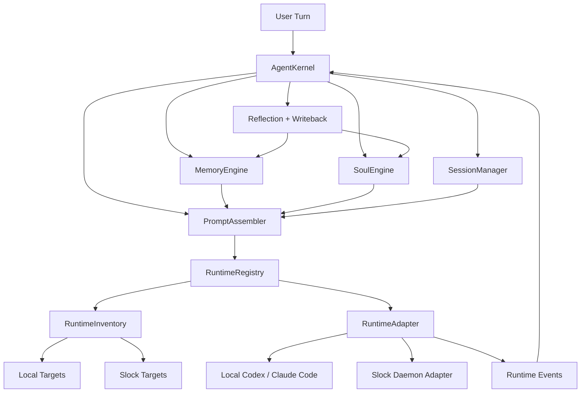

# Dev Agent Framework Architecture

## Goal

Build a TypeScript-first framework for development agents where:

- `Claude Code` and `Codex` are replaceable runtimes
- the framework owns memory, prompt assembly, and agent identity
- the same agent can keep a stable personality across runtimes
- memory is durable, reviewable, and not trapped inside provider-specific sessions

## Non-Goals

- Rebuilding shell execution, file patching, or tool runtimes from scratch
- Building a general-purpose multi-agent orchestration system in v1
- Treating raw transcript replay as memory
- Letting personality override correctness or safety

## Core Idea

Treat the runtime as an executor and the framework as the persistent mind.

- Runtime: can read, write, call tools, and stream tokens
- Framework: decides what to remember, what to inject, how to behave, and how to stay consistent

The key abstraction is an `AgentKernel` that sits above runtime adapters. A runtime target may be local, such as `codex`, or daemon-backed, such as `slock:codex`.

## Architecture



## Module Layout

```text
src/
  core/
    agent-kernel.ts
    types.ts
    errors.ts
  runtime/
    adapter.ts
    inventory.ts
    types.ts
    codex-runtime.ts
    claude-code-runtime.ts
    slock-daemon.ts
  prompt/
    assembler.ts
    layers.ts
    policies.ts
  memory/
    engine.ts
    retrieval.ts
    writeback.ts
    types.ts
    stores/
      working-store.ts
      episodic-store.ts
      semantic-store.ts
      relationship-store.ts
  persona/
    soul.ts
    soul-engine.ts
    policy.ts
  session/
    session-manager.ts
    compaction.ts
    types.ts
  skills/
    registry.ts
    types.ts
  storage/
    file-store.ts
    sqlite-index.ts
docs/
  architecture.md
  soul.md
```

## Design Principles

### 1. Files are the source of truth

Agent identity should remain inspectable without proprietary infrastructure.

- `SOUL.md` stores stable personality and standards
- `AGENT.md` stores project-level operating instructions
- `MEMORY.md` stores durable long-term notes
- daily logs and session summaries remain plain text or JSONL

Indexes can be rebuilt. Core agent state should be human-readable.

### 2. Deterministic recall before semantic recall

Memory retrieval should not start with vector search.

Recall order:

1. session state
2. task-local working memory
3. pinned project memory
4. relationship memory
5. semantic retrieval
6. archived session summaries

This keeps behavior stable and reduces retrieval noise.

### 3. Prompt layers must be explicit

Do not build one giant opaque system prompt.

Prompt composition should be traceable as:

1. base policy
2. soul layer
3. project layer
4. task layer
5. memory injection
6. reflection patch
7. runtime shim

### 4. Personality changes are controlled

The framework may infer candidate soul changes, but it should not silently rewrite identity.

- episodic and relationship memory can update automatically
- soul changes should require approval or an explicit policy gate

### 5. Ease of use beats ceremony

The framework should work well before the user writes custom config.

- ship with built-in skills
- auto-detect common workspace signals
- bootstrap sane prompt layers from the repo itself
- allow power users to override, but do not require hand-written setup on day one

## Runtime Layer

The runtime layer is split into three pieces:

1. `RuntimeDescriptor`: what target the user wants, for example `codex` or `slock:codex`
2. `RuntimeInventoryProvider`: where available runtime targets come from
3. `RuntimeAdapter`: how a target is actually executed

This split matters because `slock` is not a model runtime itself. It is a transport and discovery layer that exposes multiple runtimes behind one daemon session.

```ts
export type RuntimeTarget = string;
export type RuntimeAdapterId = string;
export type RuntimeFamily = "codex" | "claude-code" | "claude" | "demo" | "gemini";

export interface RuntimeDescriptor {
  target: RuntimeTarget;
  adapterId: RuntimeAdapterId;
  family: RuntimeFamily;
  label: string;
  transport: "local" | "daemon";
  capabilities: RuntimeCapabilities;
}

export interface RuntimeInventoryProvider {
  list(): Promise<RuntimeDescriptor[]>;
}

export interface RuntimeAdapter {
  readonly adapterId: RuntimeAdapterId;
  readonly capabilities: RuntimeCapabilities;
  readonly descriptor?: RuntimeDescriptor;

  createSession(input: CreateSessionInput): Promise<RuntimeSessionRef>;
  resumeSession(input: ResumeSessionInput): Promise<RuntimeSessionRef>;
  executeTurn(input: ExecuteTurnInput): AsyncIterable<RuntimeEvent>;
  interrupt(session: RuntimeSessionRef): Promise<void>;
}
```

### Adapter Responsibilities

- accept a resolved `RuntimeDescriptor`
- translate framework prompts into runtime-specific inputs
- normalize streamed events
- capture runtime metadata such as cost, latency, tokens, and errors
- expose runtime quirks via capability flags instead of leaking provider-specific logic everywhere

### Inventory Responsibilities

- list local static runtimes such as `demo`, `codex`, and `claude-code`
- list daemon-backed runtimes such as `slock:claude`, `slock:codex`, and `slock:gemini`
- keep target naming stable even if transport changes underneath

### Slock Modeling

The framework should model Slock as:

- inventory source
- daemon transport
- multi-runtime host

It should not model Slock as:

- a replacement for the agent kernel
- a replacement for soul or memory
- a single monolithic runtime id

### Adapter Non-Responsibilities

- deciding what memory to recall
- mutating `SOUL.md`
- selecting project context
- deciding whether a reflection should be persisted

## Agent Kernel

The `AgentKernel` owns one turn end to end.

```ts
export interface KernelTurnInput {
  agentId: string;
  runtimeTarget: RuntimeTarget;
  workspacePath: string;
  userMessage: UserMessage;
  sessionHint?: string;
}

export interface KernelTurnResult {
  session: RuntimeSessionRef;
  outputText: string;
  writeback: WritebackReport;
  diagnostics: KernelDiagnostics;
}

export interface AgentKernel {
  handleTurn(input: KernelTurnInput): Promise<KernelTurnResult>;
}
```

### Kernel Responsibilities

1. load agent state
2. restore or create session
3. retrieve relevant memory
4. assemble prompt layers
5. call the selected runtime
6. collect runtime events
7. summarize and compact the turn
8. write episodic and semantic memory
9. propose soul deltas when appropriate
10. auto-select built-in skills for the current workspace

## Built-in Skills

Built-in skills are small instruction bundles that the framework can auto-enable from workspace signals. This is the main path to an easier out-of-the-box experience.

Examples:

- TypeScript workspace skill
- CLI product skill
- verification discipline skill
- project conventions skill

The intent is similar to OpenClaw's skill concept, but lighter:

- built-in first
- no manual marketplace install for common cases
- auto-selection from repo structure
- skills become a first-class prompt layer instead of an afterthought

```ts
export interface SkillDefinition {
  id: string;
  title: string;
  description: string;
  instructions: string[];
}

export interface SkillResolver {
  resolve(workspacePath: string): Promise<SkillDefinition[]>;
}
```

### Auto-Configuration Direction

The first useful auto-configuration pass should inspect:

- `package.json`
- `tsconfig.json`
- `tests/`
- `src/cli.ts`
- `AGENT.md` or `AGENTS.md`
- `SOUL.md`

From that, the framework should enable a small set of built-in skills without asking the user to wire anything by hand.

## Prompt System

Prompt construction should be a typed pipeline, not string concatenation spread across the codebase.

```ts
export type PromptLayerKind =
  | "base"
  | "soul"
  | "project"
  | "task"
  | "memory"
  | "reflection"
  | "runtime";

export interface PromptLayer {
  kind: PromptLayerKind;
  priority: number;
  content: string;
  source: string;
}

export interface AssembledPrompt {
  system: string;
  user: string;
  layers: PromptLayer[];
}

export interface PromptAssembler {
  assemble(input: PromptAssemblyInput): Promise<AssembledPrompt>;
}
```

### Recommended Prompt Policies

- stable identity goes into `soul`
- repo-specific norms go into `project`
- request-specific instructions go into `task`
- recalled facts stay short and attributed
- reflection patches should expire quickly unless promoted into durable memory

### Runtime Shims

Do not fork the entire prompt per runtime. Add a thin runtime layer instead.

Examples:

- Codex may need stronger tool-use formatting hints
- Claude Code may need different session continuation instructions

That difference belongs in `runtime` prompt layers, not in the soul or project layers.

## Memory System

Memory should be split by purpose rather than by storage backend.

```ts
export interface WorkingMemoryEntry {
  turnId: string;
  content: string;
  expiresAt?: string;
}

export interface EpisodicMemory {
  id: string;
  timestamp: string;
  taskSummary: string;
  outcome: "success" | "partial" | "failed";
  lessons: string[];
  relatedFiles: string[];
}

export interface SemanticMemory {
  id: string;
  topic: string;
  fact: string;
  confidence: number;
  sources: string[];
}

export interface RelationshipMemory {
  id: string;
  userId: string;
  preference: string;
  evidence: string;
  confidence: number;
}
```

### Memory Tiers

#### Working Memory

- scratchpad for the current task
- short TTL
- never treated as durable truth

#### Episodic Memory

- records what happened in a task
- stores failure patterns, wins, tradeoffs, and decisions
- should be derived from summaries, not raw logs

#### Semantic Memory

- distilled durable facts
- repo knowledge, workflow knowledge, stable preferences
- should cite source artifacts

#### Relationship Memory

- how the user prefers to collaborate
- response density, risk tolerance, autonomy level, communication style

#### Persona Memory

- stable identity, standards, and tone
- stored separately from task memory
- backed by `SOUL.md`

## Memory Interfaces

```ts
export interface MemoryRetrievalQuery {
  agentId: string;
  task: string;
  workspacePath: string;
  limit: number;
}

export interface MemoryRecall {
  pinned: string[];
  episodic: EpisodicMemory[];
  semantic: SemanticMemory[];
  relationship: RelationshipMemory[];
}

export interface MemoryEngine {
  recall(query: MemoryRetrievalQuery): Promise<MemoryRecall>;
  writeTurn(result: TurnWritebackInput): Promise<WritebackReport>;
}
```

## Soul System

The soul is not a vibe prompt. It is a durable operating profile.

Recommended split:

- identity: who this agent is
- temperament: how it behaves under uncertainty
- standards: what quality bar it holds
- collaboration: how it works with the user
- voice: how it communicates
- boundaries: what it should not do

The detailed format lives in [docs/soul.md](./soul.md).

## Session System

The framework should own a logical session model even if each runtime has its own native session mechanism.

```ts
export interface LogicalSession {
  agentId: string;
  logicalSessionId: string;
  runtimeSession?: RuntimeSessionRef;
  startedAt: string;
  lastTurnAt: string;
  summary?: string;
}
```

### Session Responsibilities

- map logical sessions to runtime sessions
- summarize long-running conversations
- compact old context into stable memory artifacts
- preserve continuity when switching runtimes

### Runtime Switching Rule

If the user switches from `Codex` to `Claude Code`, the framework should preserve:

- soul
- project instructions
- pinned memory
- relationship memory
- logical session summary

The new runtime should not inherit opaque provider-specific state unless the adapter knows how to restore it safely.

## Storage Model

Recommended MVP storage:

```text
agents/
  <agent-id>/
    SOUL.md
    AGENT.md
    MEMORY.md
    relationship.md
    sessions/
      <logical-session-id>.json
    turns/
      <turn-id>.jsonl
    memory/
      daily/
        2026-03-28.md
      episodic/
        <episode-id>.md
      semantic/
        <fact-id>.md
    index.sqlite
```

### Why this layout

- human-readable core state
- cheap local development
- simple git-friendly inspection
- clean migration path to remote storage later

## Turn Lifecycle

```ts
export interface TurnPipeline {
  loadAgentState(): Promise<void>;
  loadSession(): Promise<LogicalSession>;
  recallMemory(): Promise<MemoryRecall>;
  assemblePrompt(): Promise<AssembledPrompt>;
  executeRuntime(): Promise<RuntimeTranscript>;
  summarizeTurn(): Promise<TurnSummary>;
  writeMemory(): Promise<WritebackReport>;
}
```

Recommended writeback stages:

1. persist raw runtime transcript
2. generate turn summary
3. extract episodic memory
4. distill semantic memory
5. update relationship memory
6. emit candidate soul delta

## Suggested TypeScript Conventions

- use ESM
- enable `strict` mode
- keep domain types framework-owned and runtime-neutral
- validate all adapter IO at boundaries
- keep strings out of core orchestration where enums or tagged unions work better

Suggested boundary validation strategy:

- use plain TypeScript interfaces in the core
- use runtime schemas only at adapter and persistence boundaries

## MVP Scope

### In

- one local user
- one repo at a time
- `Codex` and `Claude Code` runtime adapters
- file-backed source of truth
- SQLite index for local search
- typed prompt assembler
- soul file with controlled updates
- session summarization and compaction

### Out

- distributed orchestration
- multiple users with separate tenancy
- rich GUI
- autonomous background swarms
- complex approval workflows

## Recommended First Milestones

### Milestone 1

- define core types
- implement file-backed soul and memory stores
- implement prompt assembler

### Milestone 2

- implement `CodexRuntime`
- implement `ClaudeCodeRuntime`
- add logical session manager

### Milestone 3

- add turn summarization
- add episodic and semantic writeback
- add retrieval ranking policies

### Milestone 4

- add controlled soul revision flow
- add runtime switching
- add diagnostics and observability

## Summary

This framework should be opinionated about identity and memory, but unopinionated about the underlying executor. TypeScript is a good fit because the problem is mostly about typed boundaries, event normalization, staged pipelines, and durable domain models rather than raw inference tricks.
